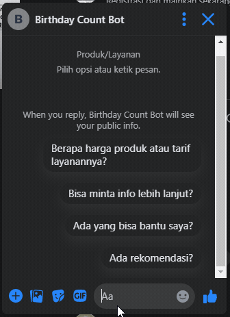

# Birthday Bot


Birthday Bot is a server side Facebook messenger bot. That simply give you number of days from today to your birthday.

## Getting Started

These instructions will get you a copy of the project up and running on your local machine for development and testing purposes. See deployment for notes on how to deploy the project on a live system.

### Prerequisites

1. [NodeJs](https://nodejs.org/en/download/) >= 12.9
2. [MongoDb](https://www.mongodb.com/) >= 4.2

### Setup

1. clone this repository

    ```bash
    git clone https://github.com/rid1hady/birthday-bot.git
    ```

2. run `npm install`. And while you waiting for npm install to finish, continue to second step.
3. Copy environment varible from `env.example` to `.env`

    ```bash
    cp env.example .env
    ```

4. Open `.env` file you just copied and fill every variables there with yours.
5. Make sure `npm install` process has been done
6. run `npm start`

## Running tests

run `npm test`

## Feature

1. Tell you how many days till next birthday. So you can prepare the best party ever! 🍻
2. Quick Reply `Yes` and `No` answer button.
3. Message management and logging via `/messages` endpoint.

## Endpoint

1. *GET* `/webhook` : to verify webhook callback url.
2. *POST* `/webhook` : to handle webhook message.
3. *GET* `/messages` : to get message log.
4. *GET* `/messages/:messageId` : to get message with corresponding id.
5. *DELETE* `/messages/:messageId` : to **delete** message with corresponding id.

## Authors

* **Ridwan Hady** - *Initial work* - [rid1hady](https://github.com/rid1hady)
